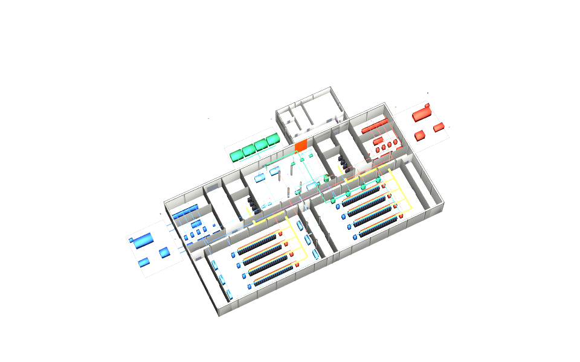

# usdaeco-bonsai — Bonsai host for driver-based USD exchange

## Use case

Edit a built element’s drivers in USD and let Bonsai solve the native model.
Sync publishes the resolved values, bodies and diagnostics in separate layers.
Read [the use case](docs/usecase.md) and [host capabilities](docs/host.md).

## The schema on an index card

| Contract | Ownership |
|---|---|
| Identity, ports, spatial referents | usdAeco core; no new schema in this integration |
| Intent, result, derived and diagnostic layers | usdAecoSync |
| `bonsai` entry point | `usdaeco_bonsai.host:BonsaiHost` |
| Geometry | Host output only; editors author drivers |

## The example

A wall move and pipe extension run in Bonsai on the full pinned base facility, then IFC is exported, re-imported and compared.

```sh
env -u PYTHONPATH "$AECO_PYTHON" examples/roundtrip/run.py
```

Inputs, expected findings and provenance live in [examples/roundtrip](examples/roundtrip/README.md).
Open [result/example.usdc](examples/roundtrip/result/example.usdc) in stock USD;
the flattened final re-import needs no family plugins or sibling checkouts.
`--publish` refreshes the committed result, layers, images and manifest.



## Build and check

Use Python with usd-core, IfcOpenShell 0.8.5, NumPy, pytest and the toolchain render dependencies.
No package installation is required for source tests. Set `AECO_PYTHON` to that interpreter,
and use sibling checkouts at the versions in dependencies.json (in particular,
core at v0.9.5 and axis at v0.1.5). Set `USDRECORD` to stock OpenUSD
`usdrecord` with Embree support and its matching imaging runtime:

```sh
export AECO_CORE="$(dirname "$PWD")/usdaeco-core"
export AECO_CORE_ROOT="$AECO_CORE"
export CORE_PLUGIN_DIR="$AECO_CORE/usdAeco"
export AECO_AXIS_ROOT="$(dirname "$PWD")/usdaeco-axis"
export AXIS_PLUGIN_DIR="$AECO_AXIS_ROOT/usdAecoAxis"
export PXR_PLUGINPATH_NAME="$CORE_PLUGIN_DIR:$AXIS_PLUGIN_DIR"
export AECO_SYNC_ROOT="$(dirname "$PWD")/usdaeco-sync"
export AECO_IFC_ROOT="$(dirname "$PWD")/usdaeco-ifc"
export TOOLCHAIN_DIR="$(dirname "$PWD")/usdaeco-toolchain"
export AECO_DATACENTRE_ROOT="$(dirname "$PWD")/usdaeco-datacentre"
export AECO_SCENARIOS_ROOT="$(dirname "$PWD")/usdaeco-scenarios"
export AECO_CCTV_ROOT="$(dirname "$PWD")/usdaeco-cctv"
export AECO_BUILDUP_ROOT="$(dirname "$PWD")/usdaeco-buildup"
export AECO_WALL_ROOT="$(dirname "$PWD")/usdaeco-wall"
export AECO_PIPE_ROOT="$(dirname "$PWD")/usdaeco-pipe"
export PATH="$(dirname "$USDRECORD"):$(dirname "$AECO_PYTHON"):$PATH"
env -u PYTHONPATH PYTHONPATH="$AECO_CORE:." "$AECO_PYTHON" check.py
env -u PYTHONPATH "$AECO_PYTHON" -m pytest -q
nix flake check
```

`AECO_CORE` selects core v0.9.5; `AECO_AXIS_ROOT` selects axis v0.1.5.
Core must precede axis on the plugin path. The three
kind libraries use their released v0.2.5 plugins. Blender 5.1.2 and Bonsai 0.8.5 supplies native execution.
Set `AECO_BLENDER` to Blender with Bonsai available. Set `USDRECORD` to an OpenUSD usdrecord executable with Embree support; the macOS
system command may implement a different CLI.
The check ends with the family `N checks, M failed` line and includes structure lint.
Source bootstrap inserts tools into sys.path and materializes entry-point metadata
under ignored out/; it does not install a package or change a dependency checkout.

Flake inputs use public release names. For local source mapping use
`nix flake check --override-input core "path:$AECO_CORE" --override-input axis "path:$AECO_AXIS_ROOT" --override-input sync "path:$AECO_SYNC_ROOT" --override-input ifc "path:$AECO_IFC_ROOT" --override-input toolchain "path:$TOOLCHAIN_DIR"`
and override other inputs similarly. See the toolchain’s
[local input policy](https://github.com/criad-com/usdaeco-toolchain/blob/v0.3.10/docs/repo-conventions.md).
Native host availability is separate from Nix evaluation. The flake and source commands use the
committed flat plugin directories; no dependency build is needed.

Sync v0.5.5 uses its own core/axis loader; CCTV is pinned at v0.5.6 for this release.

## Family

Core `>=0.9,<1.0`, axis `>=0.1,<0.2`, sync `>=0.5,<0.6`; IFC integration supplies the shared IFC
reader and authoring protocol.
Exact tested refs are in [dependencies.json](dependencies.json).
See the [family board](https://github.com/criad-com/usdaeco-board) and the
[sync host contract](https://github.com/criad-com/usdaeco-sync/blob/v0.5.5/docs/host-contract.md).

## Layout

`tools/usdaeco_bonsai/` owns the host, runtime and native protocol;
`blender/` contains the separately licensed embedded scripts;
`testenv/` owns regression cases; `docs/` describes capabilities;
`examples/roundtrip/` owns the example. This is a schema-free integration,
generated from the family skeleton and checked against its applicable S-rules.

## Status

Version 0.1.6 re-pins all eleven family inputs to public release tags.
See [public re-pin acceptance](docs/public-repin.md) for the measured source, native and publication checks.
**70 checks, 0 failed; 34 tests passed; 21/21 native cases.** Requirement ranges are unchanged.
Native tests require Blender with Bonsai. Pipe creation, general wall edits and fitting creation are outside this adapter’s supported subset.

## Licence

[MIT](LICENSE), Copyright (c) 2026 Criad, covers the host, runner, tests and
documentation. The Blender-side scripts `blender/operations.py` and
`blender/__init__.py` are **GPL-3.0-or-later**; see [blender/LICENSE](blender/LICENSE)
and [blender/README.md](blender/README.md). They run inside Blender/Bonsai.

Runtime dependencies are imported or invoked, never vendored: OpenUSD
(Apache-2.0-style TOST), NumPy and Jinja2 (BSD), PyYAML and Pydantic (MIT),
Pillow (HPND), IfcOpenShell (LGPL-3.0, imported only), and OCCT (LGPL-2.1,
dynamically linked only). Rendering uses Embree (Apache-2.0); native execution
requires Blender and Bonsai (GPL). Tests use pytest (MIT).
