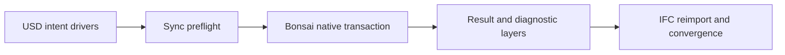

# Bonsai: the live IFC host

## 1 The problem

A coordinator can move a wall or pipe in a review model without preserving the
authoring model’s joins, connected ports or type rules. Re-entering those edits
in the authoring tool costs time and makes the two models drift. This integration
returns resolved native values and diagnostics after an explicit driver edit.

## 2 The data as it arrives

The source is an IFC4X3 document in metres.
USD carries identity, classification, axes, sections and connection relationships.
The host consumes JSON operation records; it never consumes edited meshes.
The IFC GUID decodes losslessly to the core UUID. Binding handles are caches.

## 3 The model in USD

There are no new typed prims or APIs in this integration. Referents, ports and
spatial containers come from core. Wall and pipe kinds come from their driver
libraries, with camera drivers from the CCTV library. The native host returns
plain meshes carrying AecoDerivedGeometryAPI; all derived opinions have their own layers.

## 4 Workflow

1. Configure the checkout paths in the README and the host runtime in [host.md](host.md).
2. Initialize a session from model.usda and its native document using the `bonsai` entry point.
3. Author wall or pipe drivers in intent.usda; apply them through sync.
4. Read the returned values, export and compare by core identity.
5. Repeat apply; converged intent causes zero native mutations.

Run `env -u PYTHONPATH "$AECO_PYTHON" examples/roundtrip/run.py` for the complete example.

## 5 Validation

| Rule or check | Severity | Catches |
|---|---|---|
| Structure S01–S29, applicable scopes | error | Missing contract files, pin drift, private terms, invalid images or stale results |
| Eight core registry validators | error / warn | Invalid referent structure, identity, ports and derived representations |
| Sync preflight | error | Derived edits, stale intent, unsupported operations, invalid pipe sizes |
| Native closure and readback | error | Missing accepted driver values or separated connected ports |
| Repeat apply | error | Unnecessary native mutations |
| Convergence | error / info | Driver differences / tessellation body differences |
| Native runtime | PASS or NOT RUN | Whether the native host was actually exercised |

## 6 The example on the demo data centre

The complete demo-datacentre-01 base facility is pinned at v0.4.6. The runner
imports native drivers, moves a wall by 0.15 m and extends a pipe by 0.20 m through
Bonsai, exports, re-imports and compares both bodies and 14 drivers. Every source
prim remains in the result. The pinned manifest supplies the census: 2,954 elements,
2,987 meshes, 6,212 ports, 33 spaces and two levels. Orange and cyan highlights
identify the edits in a roof-cutaway facility view and a closer corner study.
See the [example README](../examples/roundtrip/README.md) for source aliases,
publication and review-layer scope. Native operators run before rendering.

## 7 Trade-offs and alternatives

Bonsai keeps its IFC store and Blender object views coherent using explicit regeneration. The IFC file host is faster when no live view is needed.
Host-specific behaviour is exposed as diagnostics. Geometry agreement uses bounds
and volume, not triangle ordering. Cross-route identity uses IFC_GUID, never Mark.

## 8 Out of scope and open questions

Native tests require Blender with Bonsai. Pipe creation, general wall edits and fitting creation are outside this adapter’s supported subset.
Exact solid evaluation and automatic geometry pushback remain outside this release.
Native compilation and an installed wheel are separate from the source-based gates.

## 9 Status

Version 0.1.5 composes the complete base publication with toolchain v0.3.8,
retaining sync v0.5.2, core v0.9.2 and axis v0.1.2. Native readback respects the
transaction's disconnect scope and prepares imported profile sweeps for editing.
Measured results and deviations are recorded in [facility acceptance](facility-acceptance.md).
